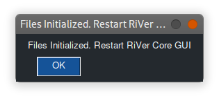
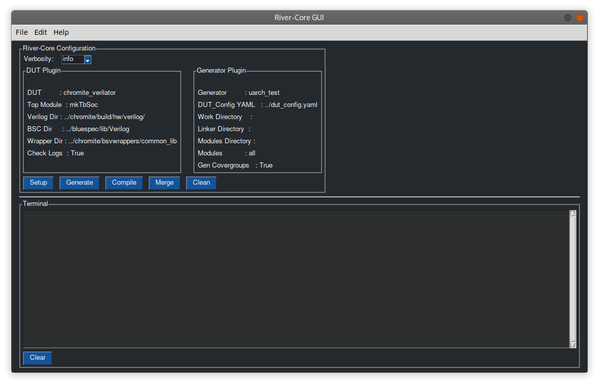
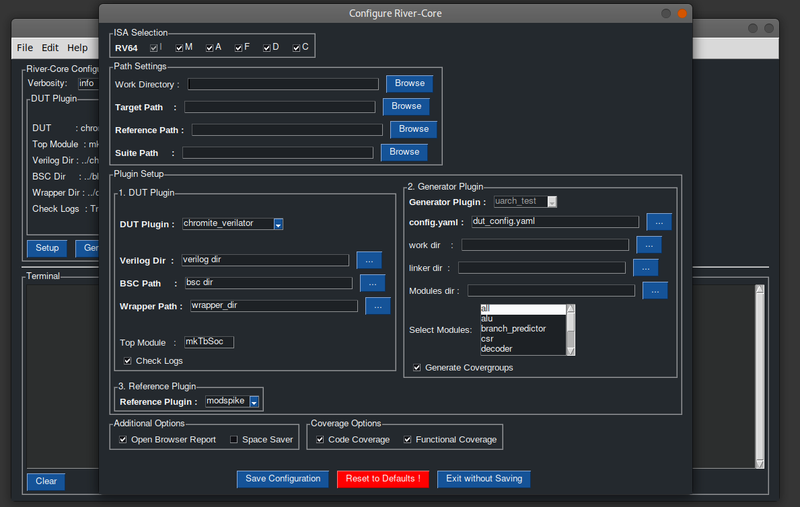
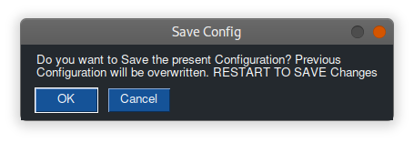
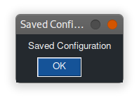
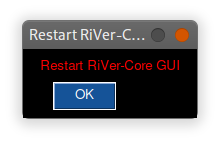
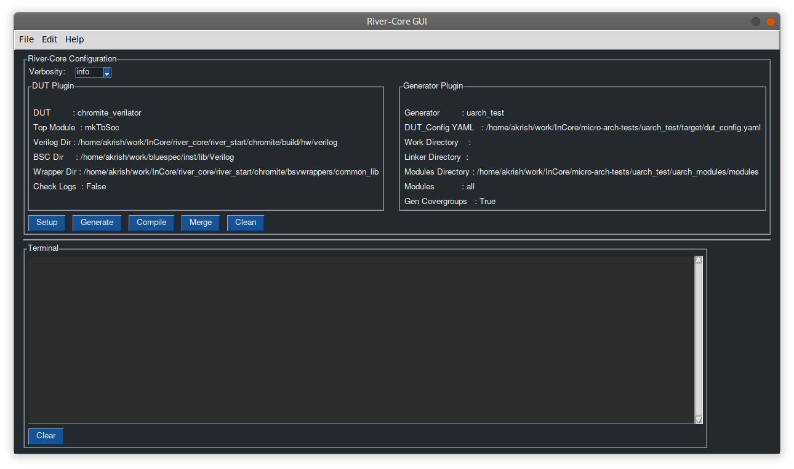
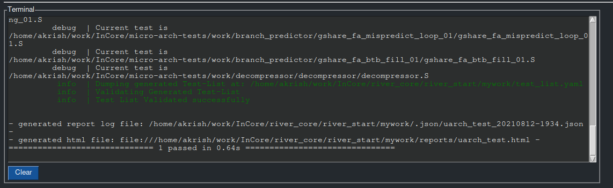

.. See LICENSE.incore for details

.. _gui:

==============
RiVer Core GUI
==============

RiVer Core Framework comes with a Graphical User Interface. The GUI can be run by invoking

::

   river_core gui
   
-------------
Using the GUI
-------------

Before you can use the GUI, you need to have installed the ``river_core_plugins`` which supports the uarch_tests generator(UTG). The forked river_core_plugin is currently hosted `here <https://github.com/alenkruth/river_core_plugins>`_. Replace your existing river_core_plugins directory with this repository and then checkout the ``utg`` branch. You should be good to go.

.. note:: Python 3.7.0 is the version of Python which we will be supporting. Please make sure you use the same.

.. note:: Please do not use the obfuscated uarch_test package.

Additionally, make sure you have installed UTG as a python package. You will have the ``micro-arch-tests`` as well as ``uarch_modules`` within the file  hosted on Onedrive. Here, ``micro-arch-tests`` is the top level directory of the ``UTG``. ``uarch_modules`` consists of the tests to be run on the DUT. Now, ``cd`` into the ``micro-arch-tests`` directory and run ``pip install --editable .`` to install UTG as a python package. Please remember where you have stored the ``uarch_modules`` directory as we will be passing the path to ``uarch_modules/modules`` directory as a parameter while setting up the GUI. 

The GUI will take care of the changes to be made to the ``river_core.ini`` or the config.ini file of your RiVer core installation. Nevertheless, you can find documentation related to the changes required using the updated river_core_plugins in the repo (`here <https://github.com/Alenkruth/river_core_plugins/tree/utg/generator_plugins/uarch_test_plugin>`_ and `here <https://github.com/Alenkruth/river_core_plugins/tree/utg/dut_plugins/chromite_verilator_plugin>`_). The documentation for the micro-arch-tests can be found in the docs directory.

Finally, we have found several issues in the current implementation and we have created a list of known issues at the end of this document. But, as it stands now, the GUI works as expected albeit the said limitations. Please let us know if you find any more :-).

Initial Setup
-------------
   
If this is the **first time** you are invoking river_core with the gui, the gui will search the directory if a ``config.ini`` file is present. If the file is not present, the tool will create the same. You will see the following screen when the gui tries to create the ``config.ini`` file.

This would have created a ``config.ini`` file with required entries in the directory from which you invoked the GUI. Clicking ``OK`` will close the GUI. You should Invoke the GUI again by running the ``river_core gui`` command.

.. note:: the GUI currently creates a file named ``config.ini`` in whatever directory it gets invoked from (even if a river_core config ``.ini`` file is present. This is being done because of certain issues we face with the ordering of sections within the .ini file. This will be fixed in coming updates.

Now, when you invoke river_core again after it creates its own config file, you will see the main page. 

The main window.

The window you see above is the main window of the GUI. This window will be used to generate and compile tests. 

When you are running GUI for the first time, it is necessary that you set-up river_core by specifying the paths, work directory, etc. similiar to the one mentioned in RiVer Core's `quickstart <https://river-core.readthedocs.io/en/stable/installation.html#setup-the-plugins>`_. 

To set-up river_core through the GUI, click on the `Setup` button you find on the main window. Once you click that, a new window titled ``Configure RiVer core`` will show up. 

The Setup page

In the setup page, you should specify the paths and parameters required to generate as well as compile tests on RiVer core. Here, we will be only talking about configuring 
  
1. **utg** as the generator.
2. **chromite_verilator** as the DUT.
3. **modspike** as the reference.

These are the default options in the GUI. It is also assumed that the river_core_plugins has been cloned and the required dependencies have been resolved before the user tries to use the GUI to generate as well as compile tests. (in the following description about using the 

.. note:: The interface which is invoked when you try to choose the directory requires you to go **into** the directory whose path you want to add, and then click ``OK``. Assume the directory structure like this ``A/B/C``. If you want to add the path to ``C``, you are supposed to navigate to the ``C`` directory and then click on ``OK``. Selecting the ``C`` from within the ``B`` and then clicking ``OK`` will add the path to ``B``, while you expect the path to ``C`` to be added. We know this is slightly cumbersome, but this limitation stems from the framework which we have chosen for rendering the GUI.

In the setup page, 

**ISA** section allows you to select the ISA for the tests. (fixed to 64bit)

**Path Settings** section is where you specify the path to the plugins as well as the work directory

- **Work Directory** should contain the path to your ``work`` directory of river_core. You can choose the directory of your choice if you do not have one already. Do not leave this field empty, if you do, the root directory will be chosen as the work directory and RiVer core will not be able to create the directory without sudo access.
- **Target Path** should contain the path to your DUT target plugin (``river_core_plugins/dut_plugins`` in this case)
- **Reference Path** should contain the path to your reference plugin (``river_core_plugins/reference_plugins`` in this case)
- **Suite Path** should contain the path to the test generator plugin (``river_core_plugins/generator_plugins`` in this case)

**Plugin Setup** section

- **DUT Plugin** section is for specifying DUT specific info
 - **DUT Plugin** list is used to select the DUT plugin which the user prefers.
 - **Verilog dir** should contain the path to the directory containing the **verilog** files of the DUT (chromite).
 - **BSC path** should contain the path to the ``/inst/lib/Verilog`` directory in the ``bluespec`` installation directory.
 - **Wrapper path** should contain the path to the ``/bsvwrappers/common_lib/`` dorectory within the DUT (chromite).
 - **Top Module** should contain the name of the top module (TB) of the DUT. It will be ``mkTbSoc`` by default, which is the top module for Chromite.
 - **Check Logs** can be enabled if the user wants to check the logs generated from the DUT (utg specific).
 
- **Generator Plugin** section is for specifying the generator specific info. **UTG** is the only plugin currently supported.
 - **config.yaml** should contain the path to the directory containing the yaml file specifying the parameters of the chromite core. (dut_config.yaml) (For chormite you can find the config file named ``default.yaml`` within sample_config directory in the chromite repo)
 - **work_dir** (optional) should contain the path to the work directory the user wants to use.
 - **linker_dir** (optional) should contain the path to the directory conatining the ``link.ld`` file and ``model_test.h`` files. If left empty, the generator will create those files.
 - **modules_dir** should contain the path to the directory containing all the tests. (path to the modules directory within the uarch_modules repository mentioned earlier)
 - **select modules** will contain all the modules for which the tests can be generated. (currently use either **All** or **branch predictor** as no other modules are supported. The modules specified other than them are just for demonstration purposes)
 - **generate covergroups** can be enabled if the user wants to generate covergroups in addition to the tests.
 
- **Reference Plugin** section is used to select the reference plugin. The user can choose the plugin between **spike** and **modspike**. But, **to run tests on chromite it is necessary to use modspike**

**Additonal Options** allows you to ``open the browser`` once generation or compilation is complete, as well as enable ``space saver``.

**Coverage options** allow you to enable ``code coverage`` and ``functional coverage`` (Functional coverage should be enabled if you wish to check coverage using chromite_questa or chromite_cadence DUT plugins)

Once you have completed making all the entries, you can click on ``Save Configuration``. Once you click on that, you'll be asked to restart RiVer Core. Click ``OK``on the messages that follow. Screenshots of the windows that come up are added.

   

   
You have now successfully set up RiVer-Core GUI. Invoke the GUI again by using the ``river_core gui`` command.

.. note:: you can always update the ``config.ini`` manually or use your existing ``river_core.ini`` file if you feel the GUI to be time intensive.  

Generating and Compiling tests
------------------------------

Now that you have configured the parameters, you can run use the GUI to generate the tests. You main window should be similiar to this.

Now you can click on the ``generate`` button to **generate** the tests. The terminal window in the bottom half of the main window will reflect your terminal. You can control the verbosity of the log generated in the terminal by selecting one of the 3 options [info, debug, error] in the ``Verbosity`` section in the top left corner of the window.

Terminal section after generation.

To **compile** the tests, you should click on the ``compile`` button near generate. This will compile the tests on the DUT and return the report of your test results. 

.. note:: The ``merge`` and ``clean`` buttons currently do not work.

-------------
Known Issues:
-------------

IMPORTANT
---------
- **Closing the setup screen (with or without saving) rewrites the config file. This is a problem when the user just wants to update a single parameter!** 
- **Find a method to list all the modules being supported currently by utg**
- **Support all the generator plugins**

LOWER PRIORITY
--------------
- Path to the config file can be passed instead of creating a config file everytime. **DONE**
- requires restart (after all operations involving writing to config file)
- reordering the config file parameters ends in a stack overflow. **DONE**
- The terminal window pastes in bulk.
- The resolution of the GUI window is fixed and not scalable. This will lead to issues in Hi-Resolution displays.
