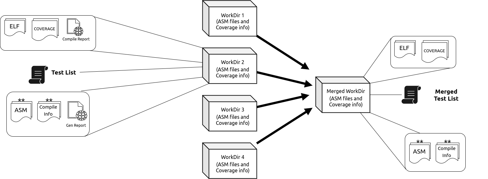

.. See LICENSE.incore for details

##########
Merge Flow
##########

The following diagram captures RIVER CORE Framework's `merge` subcommand. 
The idea behind the subcommand was to assimilate  the artifacts of various tests 
(test-lists, coverage database, ranks, etc.) into a single directory.

What does it internally do?
===========================

1. Create a new output directory, remove the existing one after confirming.
2. Parse the `test_list.yaml` from each `directory` that was received as input to the `merge` subcommand.
3. Copy the `asm` directories from original work directories into the `merged` output directory.
4. Create a new dictionary for a merged `YAML`, based on new paths.
5. Check for coverage files and if they are found, call the selected plugin in the `config.ini` and call the `merge` API.
6. After that is completed, the user is given the option to remove the original directories.

Usage Example
============

You can use the following command to merge directory databases:

.. code-block:: console

   blah blah

Merge API
=========

.. automodule:: river_core.sim_hookspecs.DuTSpec
.. autofunction:: merge_db
