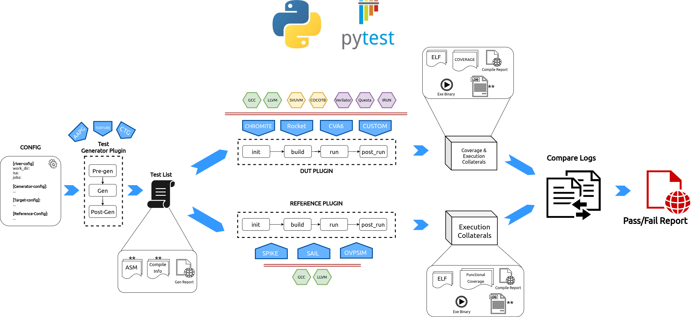
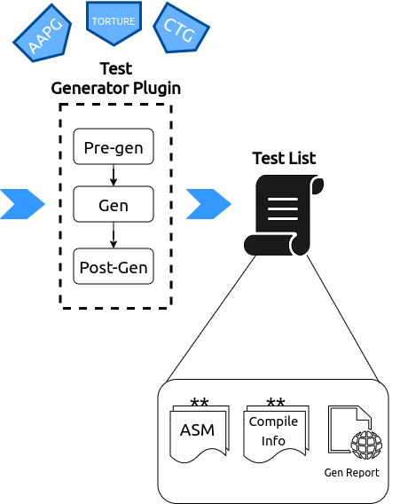
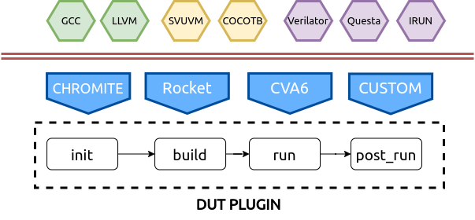
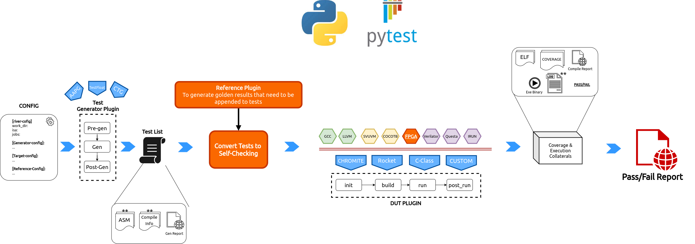
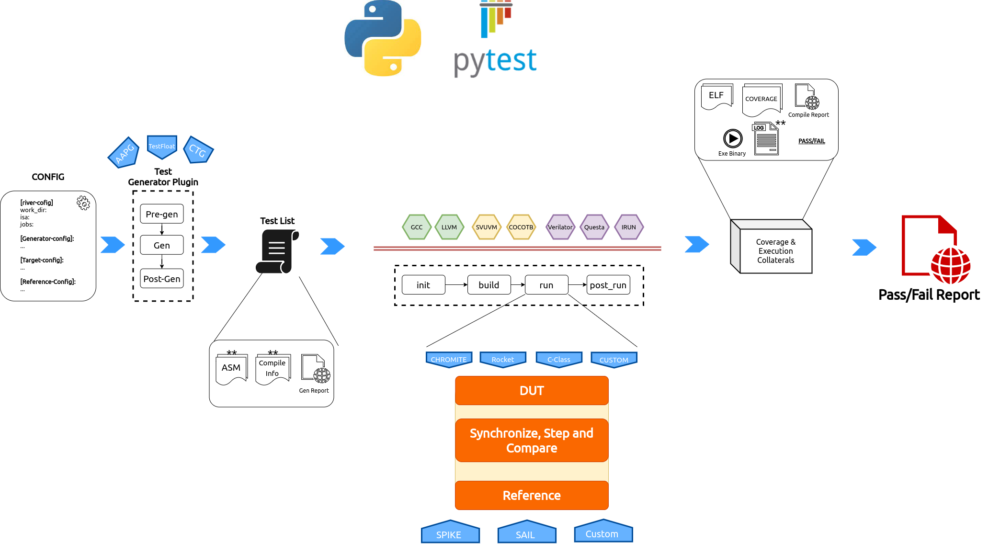

.. See LICENSE.incore for details

.. _overview:

##################
Framework Overview
##################

    
    RiVer Core Overview Flow

RiVer Core splits the verification flow into the following stages:

1. **Test Generation**: This phase uses multiple user configured generators of 
   different kind to generate tests and create a combined test-list. This now 
   becomes a sort of a regression suite that needs to be run on the target and
   the reference.
2. **Target Run**: The generated tests from the previous stage are compiled and
   loaded into the target's custom test-bench and simulated. The execution logs for 
   each test are saved. All of the above steps are encapsulated inside a python
   plugin and thus any core with any environment can easily be integrated into
   RiVer Core as a target.
3. **Reference Run**: The same tests are compiled and run on the reference model of
   choice and the execution logs are saved.
4. **Compare Logs**: The execution logs for each test from the target and the
   reference model are compared and a Fail result is captured is the logs are
   different. 
5. **Report Generation**: Generate an html report capturing the results of all
   of the above steps.

RiVer Core uses the `Pluggy <https://pluggy.readthedocs.io/en/latest/>`_ python package to manage plugins.
Additionally, RiVer can be stopped at any of the points above allowing the user to diverge to a
custom flow using any of the artifacts of interest.

The Input Config File
=====================

The entire configuration and flow of the framework is controlled via the input
``config.ini`` file. This file is used to capture some of the following
parameters:

- The work directory where all artifacts of generation and simulation are
  kept.
- The overall ISA string supported by the target
- The list of generators to be used and their configurations to generate
  tests.
- Configuration parameters of the Target. This is particularly useful when working with core generators 
- Configuration parameters of the reference model.
- Whether coverage should be enabled by the target and if so, what metrics ?

A sample template of the config.ini file is shown below. More details of syntax
can be found here :ref:`Config Spec<config_ini>`.

.. code-block:: ini

  work_dir = test 

  target = chromite_verilator
  reference = spike 
  generator = testfloat, aapg
  isa = rv64imafdc
  
  # Set paths for each plugin
  path_to_target = ~/river_core_plugins/dut_plugins
  path_to_ref = ~/river_core_plugins/reference_plugins
  path_to_suite = ~/river_core_plugins/generator_plugins
  
  open_browser = True
  space_saver = True
  
  [coverage]
  code = False
  functional = False
  
  [testfloat]
  jobs=8
  seed = random
  count = 1
  filter = 
  config_yaml = ~/river_core_plugins/generator_plugins/testfloat_plugin/testfloat_gen_config.yaml
  
  [aapg]
  jobs = 8
  filter = rv64imafdc_hazards_s
  seed = random
  count = 2
  config_yaml = ~/river_core_plugins/generator_plugins/aapg_plugin/aapg_gen_config.yaml
  
  [chromite_verilator]
  jobs = 8
  filter = 
  count = 1
  src_dir = ~/chromite/build/hw/verilog/,~/bsc/inst/lib/Verilog,~/chromite/bsvwrappers/common_lib
  top_module = mkTbSoc
  
  [spike]
  jobs = 1
  filter =
  count = 1

  
Generator Plugin
================

    
    Generator Plugin

This plugin is used encapsulate various test-generators. These generators can be
either random program generators like `AAPG <https://gitlab.com/shaktiproject/tools/aapg>`_, `RISC-V Torture <https://github.com/ucb-bar/riscv-torture>`_ , 
`CSmith <https://embed.cs.utah.edu/csmith/>`_ , `MicroTesk <http://www.microtesk.org/>`_ , `Test Float <http://www.jhauser.us/arithmetic/TestFloat.html>`_ etc. OR may include a directed
test-generators like `CTG <https://riscv-ctg.readthedocs.io/en/latest/>`_ OR a static test suite like the ones hosted 
at the `RISC-V TESTS <https://github.com/riscv/riscv-tests>`_ .

Each test generator is a python plugin which supports 3 hooks, called in the
following sequence:

1. **Pre-gen**: This stage is used to configure the generator, check and install
   dependencies, download artifacts, create necessary directories, parse and capture the plugin 
   specific parameters present in the ``config.ini``  etc. 

2. **Gen**: This stage is where the actual tests are generated. RiVer Core uses
   the inherent pytest framework to run parallelized commands. Using pytest,
   enables using default report templates which are quite verbose and helpful in
   debugging as well. 

   The major output of this stage is a test-list YAML which
   follows the syntax/schema mentioned in :ref:`Test List Format<testlist>`.
   this test list capture all the information about the test and necessary
   collateral required to compile each test. By adopting a standard test-list 
   format, we inherently allow any source of tests to be integrated into RiVer 
   CORE as a generator plugin as long as a valid test list is created.

3. **Post-Gen**: This stage is called after all the tests are generated and can
   be used to post-process the tests, validate the tests, profile the tests, remove
   unwanted artifacts, etc.

At the end of the 3 phases RiVer Core also generates an HTML reports which
captures the log of each test generation and any errors that were caught,
thereby providing a complete database of information on the test-generation
aspect. 

The generated tests are available in the directory mentioned in the ``work_dir``
parameter of the ``config.ini`` file passed to the ``generate`` command.

.. warning:: It is not advised to modify the tests or directory structures in
   the the work_dir manually. 

The plugin hooks usage and arguments are presented below:

.. automodule:: river_core.sim_hookspecs
   :members: RandomGeneratorSpec

DUT/Target Plugin
=================

    
    DUT/Target Plugin

This plugin encapsulates the DUT's/Target's compile and test environment. The plugin allows a user
complete control over:

- choice of toolchain to be used for compiling the tests: GCC, LLVM, Custom, etc
- choice of test-bench environment : SVUVM, Cocotb, etc.
- choice of simulator : Questa, Cadence, Verilator, etc
- choice of coverage metrics to enable: functional, structural, etc

The DUT Plugin supports the following hooks:

1. **Init**: This stage is used to capture configurations from the input ``config.ini`` and build
   and set up the environment. If a core generator is the target, then this stage can be used to
   configure it and generate and instance, build the relevant toolchain, setup simulator args like
   coverage, verbosity, etc. The test list is also available at this stage. Which must be captured and
   stored by the plugin for future use.

2. **Build**: This stage is used to create a Makefile or script to actually compile each test,
   simulate it on the target. A typical use case is to create a makefile-target for each test
   that needs to be run on the target. 

   .. note:: The target must run all the tests in the test-list provided and should not perform any
      filtering and skip any tests and should neither modify the tests 

3. **Run**: This stage is used to run the tests on the DUT. It is recommended to run the tests in
   parallel. RiVer Core uses the inherent pytest framework to run terminal commands in parallel
   fashion. This stage will generate all the artifacts of the simulation like : signature file, 
   execution logs, test-binary, target executable binary, coverage database, simulation logs, etc. 

4. **Post-Run**: This stage is run after the pass-fail results have been captured. This stage can be
   used to clean up unwanted artifacts like : elfs, hexfiles, objdumps, logs, etc which are no
   longer of consequence. One can further choose to only delete artifacts of passed tests and retain
   it for tests that failed (the pass/fail result is captured in the test-list itself). 

   This stage can also further also be used to merge coverage databases of all the test runs, rank
   the tests and generate appropriate reports. This is completely optional and upto the user to
   define what happens as a "clean-up" process in this stage.
   

The plugin hooks usage and arguments are presented below:

.. automodule:: river_core.sim_hookspecs
   :members: DuTSpec

The Reference Plugins
=====================

The reference plugins use the same hooks and class as the DUT/Target plugins. Similar operations as
mentioned above are performed for the reference plugin. However, in terms of coverage, certain
reference models may have capabilities to generate certain functional coverage metrics. This can be
exploited in these plugins as well.

Compare Outputs
===============

In order to declare the tests have passed, the execution logs from the DUT/Target and the reference
models are compared. A difference in the logs indicates the test has failed, else it has passed. The
result of the tests is updated in the test-list itself. 

.. note:: RiVer Core currently only supports compare a single execution log for a test. There is a need
  however to compare multiple artifacts (like signature contents as well) of a test execution. Future
  versions of RiVer Core may include these features.

Test Report Generation
======================

Once the test results are obtained and updated in the test-list, an HTML report containing
information of each of the above steps is generated for the user. The automatic browser pop-up can
be disabled by setting the ``open_browser`` parameter to false in the input ``config.ini`` file.

Each plugin run (generator, dut or reference) also creates a json report of the run which can
easily be populated into html files for better visualization.

Future Work
===========

Currently the RiVer Core framework depends on the log based comparison to decide on whether a test
passed or failed. While this works for most scenarios, for larger tests the logs can soon become
huge where the file-io itself starts to consume large amounts of time thereby increasing simulation
time significantly. This limitation further requires that the architectural state dump occurring per
instruction is kept as low as possible to keep the sizes of the logs as small as possible. Thus
certain side-effects and corrupted architectural state (like wrongly updating multiple registers 
on an instruction commit) cannot be easily found. Furthermore, such framework cannot be ported to 
FPGAs either for accelerated verification.

To alleviate some of the above limitations (to a certain extent), RiVer Core plan to add the
following two variant methodologies. Note there are just proposals and actual implementations of the
idea may vary significantly that the description provided below:

Self-checking Tests
-------------------

The below diagram highlights the flow of enabling self-checking tests in RiVer Core.

    
    RiVer Core Self Checking tests Methodology.

There are two major differences in this flow as compared the conventional flow presented earlier:

1. The generated tests are modified to become self-checking in nature. 
2. The tests are run on the target only - which could now be FPGAs as well.

To make a test self-checking would mean the results of operations must be embedded in the test
itself. However, embedding the result of every op will result in a huge memory requirements and will
also reduce the quality of the test significantly. We therefore adopt a similar methodology adopted
by `AAPG <https://gitlab.com/shaktiproject/aapg>`_, wherein at frequent intervals a checksum
function is called which calculates the checksum of the required architectural state and checks if they match
the golden value of the checksum at that point. 

To generate the golden checksum values, we run the test on a reference plugin first and then append
the golden results back into the test. Since these checksum functions are nothing but regular
assembly/c functions a simulator does not require any new features other than to dump out the golden
checksum results into a file.

To call a checksum function one can either use the ``jump`` instruction to directly jump to the
checksum function. We would rather prefer to use an ``ebreak`` instruction where the checksum can 
now act as a regular ISR routine.

At the end of tests, if all checksums have matched, either a console write can be performed or a
specific memory region can be updated with a unique value to indicate if the test has passed or
failed.

From the above definition and flow, it is obvious on FPGA emulation platforms can be leveraged to
perform accelerated testing of the design.

To convert a test into self-checking the following needs to be done for each test:

1. Add calls to checksum functions periodically in the original test 
2. Create a memory region which can save the golden checksum values generated by the reference
   plugin
3. Append code section of the test to include the checksum functions and include a pass fail
   indication logic as well.

It is expected that a majority of the tests can be made self-checking using the above ideas.

Support for Step-Compare
------------------------

In the above scheme the frequency of the checksum calls defines the confidence in the design and
test. To gain confidence, one would like to test at almost every instruction, which can turn out to
be counter productive for self-checking tests.

Also, the current framework (and the self-checking framework) does not support testing of asynchronous 
events like external interrupts on the target. Testing these features requires mimicking these
asynchronous events on the reference model at the exact same architectural instant as seen by the
target. 

To enable such capabilities, we propose to support a 'step-n-compare' flow where the target
and the reference model are instantiated in the same test environment (like SVUVM, COCOTB, etc)
and are synchronized such that any architectural update on the DUT is compared with a similar update
occurring on the reference model. This allows significantly granularity of checks and also enable
testing of asynchronous events.

    
    RiVer Core Step Compare Methodology

More details on this environment will come soon !
